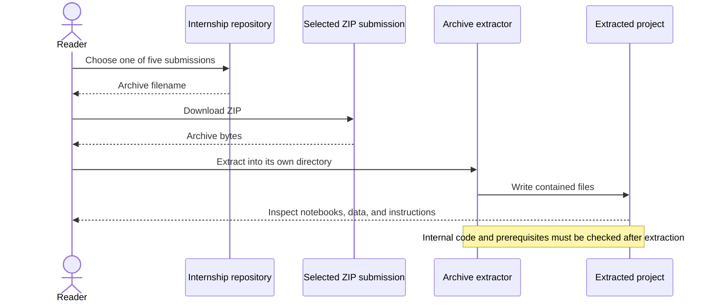

# Elevvo Machine Learning Internship Projects

A collection of machine learning task submissions distributed as ZIP archives.

**Technology:** Machine learning project collection · Archived source files

## Features

- Organize separate submissions for customer segmentation, loan approval, movie recommendation, student performance, and a `GTRSB` task archive.
- Keep each task's files in its own downloadable archive.

## Repository guide

| Path | Purpose |
|---|---|
| [Customer_Segmentation.zip](Customer_Segmentation.zip) | Customer segmentation submission. |
| [Loan-Approval-Prediction.zip](Loan-Approval-Prediction.zip) | Loan approval prediction submission. |
| [Movie Recommendation System.zip](Movie%20Recommendation%20System.zip) | Recommendation system submission. |
| [Student_Performance_Factors.zip](Student_Performance_Factors.zip) | Student performance submission. |
| [GTRSB.zip](GTRSB.zip) | Task archive named GTRSB. |

## Requirements and current limitations

Extract a task archive to a separate directory, inspect its notebooks/scripts and any dependency files, then follow that task's own setup. The repository does not expose extracted source files, so individual model architectures, metrics, entry points, and dependency versions are not verified here. There is no shared application launch command.

## UML diagrams

### Submission inspection workflow

This sequence describes working with the five committed ZIP submissions. Their internal implementations were not available for inspection, so the diagram does not assert a model architecture.

## Getting started

Download the archive listed above from this repository and extract it with a compatible archive utility. Setup depends on the files inside the archive; inspect them before running code.
